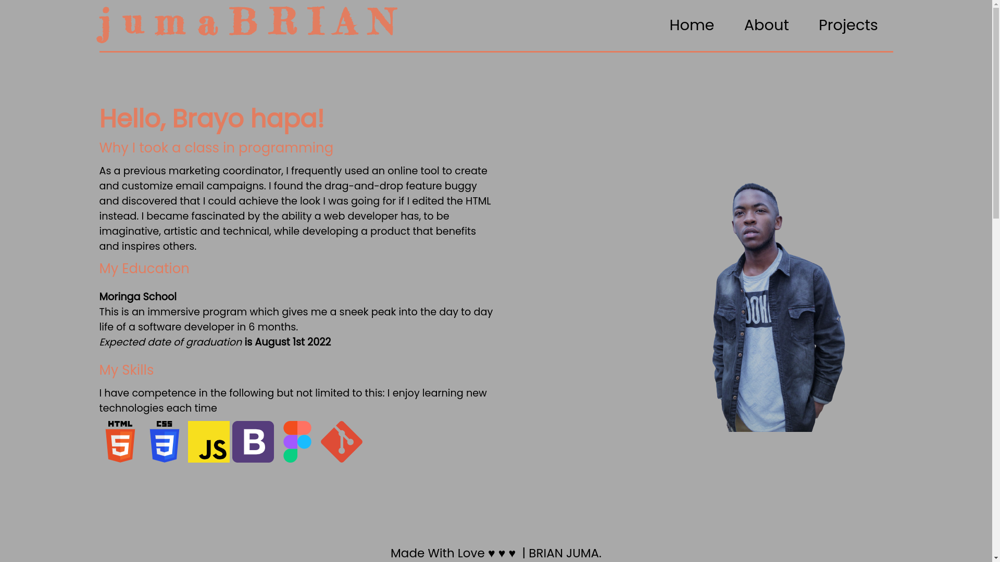

# PORTFOLIO

## Project Description
As a software developer I am indebted to showcase off my skills and previous work/accomplishments to the public. I turned to the web as the best platform for me and so this project is simply a web page to help me accomplish that objective. Welcome to my Portfolio.
## Built With
* HTML - Used to define page content.
* Vanilla Css - Custom css for page styling.
* Google fonts - For customized fonts
* Iconify - provide external icons.

## Setup
* Make sure to have internet access.
* Click on the link provided in project description.
* Live link -  
* Enjoy the live site!!!
  
## Author
BRIAN JUMA

* Contact me: brian.juma@student.moringaschool.com

## License
MIT License

Copyright (c) 2022 jumaBrian

Permission is hereby granted, free of charge, to any person obtaining a copy
of this software and associated documentation files (the "Software"), to deal
in the Software without restriction, including without limitation the rights
to use, copy, modify, merge, publish, distribute, sublicense, and/or sell
copies of the Software, and to permit persons to whom the Software is
furnished to do so, subject to the following conditions:

The above copyright notice and this permission notice shall be included in all
copies or substantial portions of the Software.

THE SOFTWARE IS PROVIDED "AS IS", WITHOUT WARRANTY OF ANY KIND, EXPRESS OR
IMPLIED, INCLUDING BUT NOT LIMITED TO THE WARRANTIES OF MERCHANTABILITY,
FITNESS FOR A PARTICULAR PURPOSE AND NONINFRINGEMENT. IN NO EVENT SHALL THE
AUTHORS OR COPYRIGHT HOLDERS BE LIABLE FOR ANY CLAIM, DAMAGES OR OTHER
LIABILITY, WHETHER IN AN ACTION OF CONTRACT, TORT OR OTHERWISE, ARISING FROM,
OUT OF OR IN CONNECTION WITH THE SOFTWARE OR THE USE OR OTHER DEALINGS IN THE
SOFTWARE.
